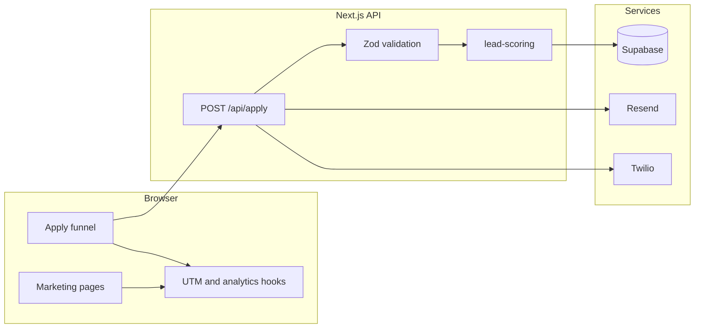

# Built Together Funding Corp — implementation plan

## What was read (source of truth)

All markdown and PDFs under [`C:\Users\Asus\BTF CORP\context`](C:\Users\Asus\BTF CORP\context)(C:\Users\Asus\BTF CORP\context)(C:\Users\Asus\BTF CORP\context) were used, including:

- [`00-read-this-first/BTF_Master_Project_Summary_Read_This_First.pdf`](00-read-this-first/BTF_Master_Project_Summary_Read_This_First.pdf)(C:\Users\Asus\BTF CORP\context\00-read-this-first\BTF_Master_Project_Summary_Read_This_First.pdf) — brand, pages, funnel, backend, tracking, compliance, phased Cursor build.
- [`08-missing-context/BTF_Missing_Context_Pack_for_Cursor.pdf`](08-missing-context/BTF_Missing_Context_Pack_for_Cursor.pdf)(C:\Users\Asus\BTF CORP\context\08-missing-context\BTF_Missing_Context_Pack_for_Cursor.pdf) — detailed scoring weights, 7-step funnel flow, Supabase field types (`use_of_funds` as `text[]`), API contract (`POST /api/apply`), email/SMS templates, analytics events, gclid/fbclid, QA/deploy checklist.
- [`04-stack/BUILD-HANDOFF-FOR-CHATGPT.pdf`](04-stack/BUILD-HANDOFF-FOR-CHATGPT.pdf)(C:\Users\Asus\BTF CORP\context\04-stack\BUILD-HANDOFF-FOR-CHATGPT.pdf) — Next.js 15 App Router, `trailingSlash: true`, env pass-through for Supabase, security headers, image config, `vercel.json` (`framework: nextjs`, `buildCommand: next build`). **Blog/cron from Wash Kings will not be copied** unless you later want it.
- [`01-brand/built_together_brand_kit_handoff.pdf`](01-brand/built_together_brand_kit_handoff.pdf)(C:\Users\Asus\BTF CORP\context\01-brand\built_together_brand_kit_handoff.pdf) + [`01-brand/logo-reference-images/logo-usage-notes.md`](01-brand/logo-reference-images/logo-usage-notes.md)(C:\Users\Asus\BTF CORP\context\01-brand\logo-reference-images\logo-usage-notes.md) — colors, typography direction, logo file roles.
- Strategy/site-reference PDFs in `02-strategy` / `03-site-references` — positioning and reference-site *principles only* (no copying).
- Placeholder `*-notes.md` in `05–07` — point to the PDFs above; no extra rules there.

Logo PNGs to copy into [`public/brand/`](public/brand/): `btf-logo-main-stacked-lockup.png`, `btf-logo-horizontal-header-lockup.png`, `btf-logo-icon-mark.png` (from [`context/01-brand/logo-reference-images`](context/01-brand/logo-reference-images)(C:\Users\Asus\BTF CORP\context\01-brand\logo-reference-images)).

---

## Phase 1 (first executable step after approval): `CONTEXT-INDEX.md`

**Deliverable:** [`CONTEXT-INDEX.md`](CONTEXT-INDEX.md) at repo root summarizing:

| Section | Content source |

|--------|----------------|

| Brand / design / logo | Brand kit + logo usage notes + your prompt |

| Funnel / questions / result copy | Master summary + missing-context §6–7 |

| Compliance / legal | Missing-context §4 + master summary §8 |

| Lead scoring | Missing-context §7 (numeric rules, thresholds 70+ / 45–69 / 0–44) |

| Stack / deploy | Stack PDF + your required deps (Framer Motion, Zod, RHF, Supabase, Resend, Twilio) |

| Pages / routes | Master summary + missing-context §12 (note **`/privacy-policy` vs `/terms` vs `/disclosures`** per your list) |

| Backend | Zod validate → score → Supabase insert → Resend/Twilio (guarded) → safe JSON response |

| Supabase schema | Align with your column list; use **`use_of_funds` as `text[]`**, **`raw_answers` JSONB**, **`landing_page`** (maps to “landing path” in docs), statuses: `new`, `prequalified`, `needs_review`, `not_fit`, `contacted`, `call_booked`, `submitted_to_partner`, `funded`, `lost` |

| Tracking | UTM + gclid/fbclid persistence; events from missing-context §11; GA4 / Meta / Google Ads **env-gated** placeholders |

| Automation copy | Your specified applicant + internal templates (unify env name **`INTERNAL_NOTIFY_EMAIL`** in `.env.local.example` to match your prompt; implementation can read the same) |

| Deployment | Vercel env list, redeploy after env changes, trailing-slash consistency |

| Build order | Your Phases 1–10 (this plan matches them) |

**API response vs DB status:** Missing-context asks for `{ status: 'prequalified' \| 'needs_review' \| 'not_fit_yet' }` to the client; DB can store `not_fit` for the third bucket. The index will document this mapping explicitly.

**Stop point:** Per your instruction, implementation pauses after `CONTEXT-INDEX.md` until you approve continuing to Phase 2.

---

## Phase 2: Scaffold

- Create Next.js 15 App Router project at **`C:\Users\Asus\BTF CORP`** (current workspace root): `package.json`, [`next.config.ts`](next.config.ts) or `js` (TS project → prefer `next.config.mjs`/`ts` per Next 15 conventions), [`tailwind.config.ts`](tailwind.config.ts), [`postcss.config.js`](postcss.config.js), [`tsconfig.json`](tsconfig.json), [`eslint.config.mjs`](eslint.config.mjs) or `.eslintrc` with **next lint**, [`vercel.json`](vercel.json) (no Wash Kings blog cron).
- Set **`trailingSlash: true`** and mirror stack PDF: Supabase public env in config, security headers, image `avif`/`webp`.
- Add [`.env.local.example`](.env.local.example) with **your** variable names (including `NEXT_PUBLIC_GOOGLE_ADS_CONVERSION_LABEL`); document PDF’s `GOOGLE_ADS_CONVERSION_LABEL` as an alias if needed.
- Add [`README.md`](README.md): install, dev, lint, build, deploy, Supabase SQL snippet location.

---

## Phase 3: Design system + shell

- **Fonts:** `next/font` — **Inter Tight** (primary) as closest built-in match to brand kit; optional second display font only if it stays minimal.
- **Tailwind theme:** CSS variables or `theme.extend.colors` for `#0A0A0A`, `#121212`, `#1A1A1A`, support grays, accents `#35C2FF`, `#4FBFFF`, `#6FD3FF`.
- **Components:** layout wrapper, [`components/site-header.tsx`](components/site-header.tsx) (horizontal logo), footer (logo + legal links + disclaimer snippet), primary/secondary buttons, card, section container, CTA block, **Disclaimer** strip (compliance).
- **Motion:** Framer Motion for section reveals and funnel step transitions (restrained).
- **Assets:** Copy logos to [`public/brand/`](public/brand/); favicon from icon mark.
- **All `Link` hrefs** use trailing slashes to match config.

---

## Phase 4: Homepage `/`

Build sections in **your specified order** (hero with stacked logo or icon, operator-led, who we help / not for, funding uses, apply preview, process, founder story with **only context-approved facts** — e.g. MCA background, ~$1.8M+/50+ businesses if present in brand/strategy PDFs; verify against [`built_together_funding_prompt.pdf`](built_together_funding_prompt.pdf)(C:\Users\Asus\BTF CORP\context\02-strategy\built_together_funding_prompt.pdf) / [`btf_system_exact.pdf`](btf_system_exact.pdf)(C:\Users\Asus\BTF CORP\context\02-strategy\btf_system_exact.pdf) during copy pass), trust, FAQ (from missing-context question list), final CTA. Primary CTA **“See If You Qualify”** → `/apply/`, secondary **“How It Works”** → `/how-it-works/`.

---

## Phase 5: Marketing pages

Implement: [`app/how-it-works/page.tsx`](app/how-it-works/page.tsx), `who-we-help`, `funding-uses`, `about`, `resources` (hub + minimal real stubs or topic cards—**no lorem**), `contact` (phone/email from env, disclosure line).

---

## Phase 6: Application funnel `/apply/`

- Multi-step client flow (missing-context **7-step** grouping can map to fewer UI steps if grouped logically).
- Progress bar, animated transitions, loading state with **icon mark** and rotating compliant loading lines from your prompt.
- React Hook Form + Zod resolver for client validation; **server remains source of truth**.
- Result UI by score band; **never** “approved” / “guaranteed”; use allowed phrases only.
- On mount: restore/persist UTM + gclid/fbclid + landing path (localStorage/session).

---

## Phase 7: Backend [`app/api/apply/route.ts`](app/api/apply/route.ts)

1. Zod schema (shared with client types in [`lib/validation`](lib/validation)).
2. [`lib/lead-scoring`](lib/lead-scoring) — implement missing-context §7 rules (industry, TIB, revenue, use of funds, demand/capacity, readiness, existing funding).
3. Supabase insert via **service role** server client only [`lib/supabase/server.ts`](lib/supabase/server.ts).
4. [`lib/resend`](lib/resend), [`lib/twilio`](lib/twilio): no-op or log when keys missing; never throw to client.
5. Applicant email always (if Resend configured); applicant SMS **only if `sms_consent`**; internal email/SMS when configured.
6. Return safe payload: result tier + generic message; no PII echo beyond “received”.

**SQL / migration notes:** [`docs/supabase-leads.sql`](docs/supabase-leads.sql) or [`supabase/migrations/`](supabase/migrations/) with RLS note: **insert via service role from API only**; document optional future RLS for admin.

---

## Phase 8: Legal

- [`app/privacy-policy/page.tsx`](app/privacy-policy/page.tsx), [`app/terms/page.tsx`](app/terms/page.tsx), [`app/disclosures/page.tsx`](app/disclosures/page.tsx) — placeholder **but substantive** sections (cookies, analytics, no guarantees, not legal advice, attorney review).
- Footer + apply flow: visible disclaimers.

---

## Phase 9: Tracking [`lib/tracking`](lib/tracking)

- `trackEvent(name, payload)` stub that pushes `dataLayer` / `gtag` / `fbq` **only when** respective `NEXT_PUBLIC_*` IDs exist.
- Thin wrappers/components for CTA clicks, phone clicks, apply start, step complete, submit, result type.
- Document event names aligned with missing-context §11.

---

## Phase 10: QA + optional admin

- Run `npm run lint` and `npm run build`; fix until green.
- **Optional:** [`app/admin/leads/page.tsx`](app/admin/leads/page.tsx) protected by **`ADMIN_DASHBOARD_SECRET`** (query param or cookie set via simple gate route)—**documented as scaffold only**, not production auth.

---

## Architecture (high level)

---

## Risks / decisions already resolved in this plan

- **Trailing slashes:** Required by stack handoff; all routes and canonical links must match.
- **`use_of_funds`:** Store as PostgreSQL `text[]` per missing-context; form multi-select maps to array.
- **Env naming:** Standardize on your `.env.local.example` list in the repo; `CONTEXT-INDEX.md` will note any PDF alias.
- **No fake social proof:** No fake testimonials, partner logos, or invented stats; founder numbers only if confirmed in strategy PDFs during copywriting.

---

## Your approval gates

1. Approve **this plan** (and Phase 1 output [`CONTEXT-INDEX.md`](CONTEXT-INDEX.md) once generated).
2. Then proceed **phase-by-phase** as you prefer (or approve all remaining phases in one go).